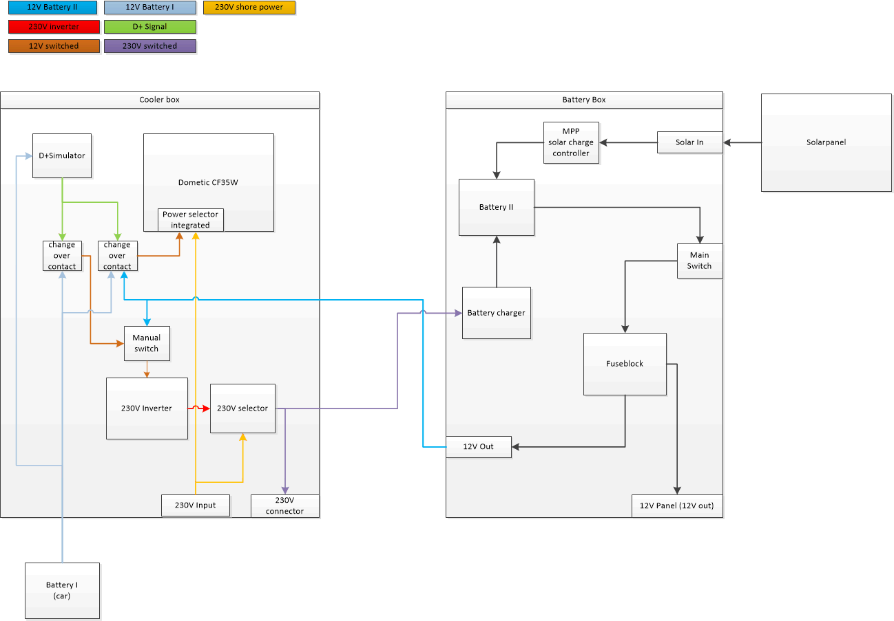

[<< back](/README.md)

# Electrical installation

## Requirements

- Cooler can operate with 12V Kfz power while the generator (motor) is running
- Cooler can operate with 12V of a secondary battery while car is parking
- Cooler can operate with 230V shore power (e.g. on a campsite)
- The independent secondary battery will be charged while the generator (motor) is running or connected to shore power with an Bosch battery charger. The battery charger will be supplied by an 12V --> 230V inverter
- The switch over will be done automatically

## Solution

- A D+ Simulator detects, when the car generator is running
- The D+ Simulator activates two relais (K1/K2) with changeover contact
- K1 supplies the cooler with 12V (from main battery when motor is running, from secondary battery when motor is off)
- K2 supplies the inverter with 12V when motor is running. When motor is off, inverter is not in operation)
- The inverter activates a relais K3 to forward the 230V to the battery charger to charge the secondary battery

## Electrical scheme

## Remark

My solution is based on the idea, that I don't want to install a fully integrated secondary battery.
**Why?** I like to do everything by myself and as cheap as possible. And I watched many Youtube videos how to install an secondary battery under the drivers seat. But I came to the conclusion, that I shun the effort and have many respect to demount some parts of my car. So I had the idea to integrate a secondary battery in a euro box. That makes me more flexible and I don't have the effort to visit an professional garage.

Just for information: I'm an electical engineer and I guess I know what I do.

## Disclaimer

The schematic here on GitHub is just an proof of concept. It doesn't fulfill all the electrical requirements regarding safety and established standards. This battery is a self made project and must not be created if you aren't a electrical specialist. Building the battery box is on your own risk.
