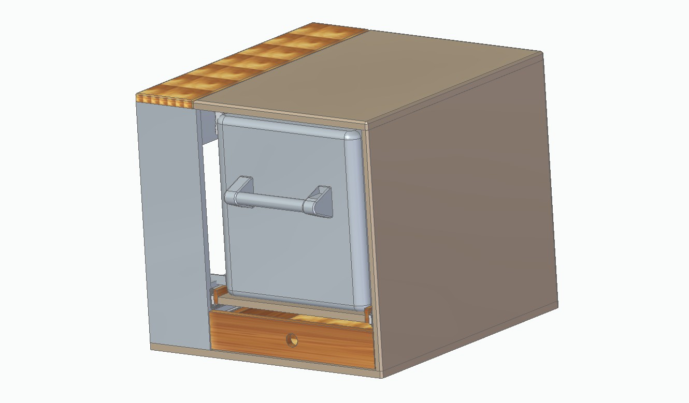

# MultivanCoolerBox

This is a do-it-yourself project to integrate a Dometic CW35 cooler into a VW Multivan

    <table>
        <tr>
            <td>
                
            </td>
        </tr>
    </table>

[Overview](Doc/Images.md)  
[Technical Data](Doc/TechnicalData.md)  
[Electical installation](Doc/ElectricalInstallation.md)

# [Lizenz](Licence.md)

 Dieses Werk ist lizenziert unter einer <a rel="license" href="http://creativecommons.org/licenses/by-nc-sa/4.0/">Creative Commons Namensnennung - Nicht-kommerziell - Weitergabe unter gleichen Bedingungen 4.0 International Lizenz</a>.
